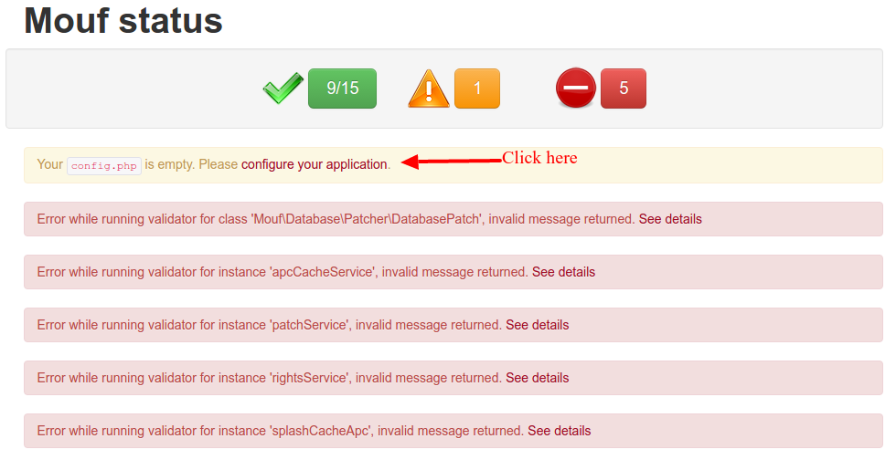
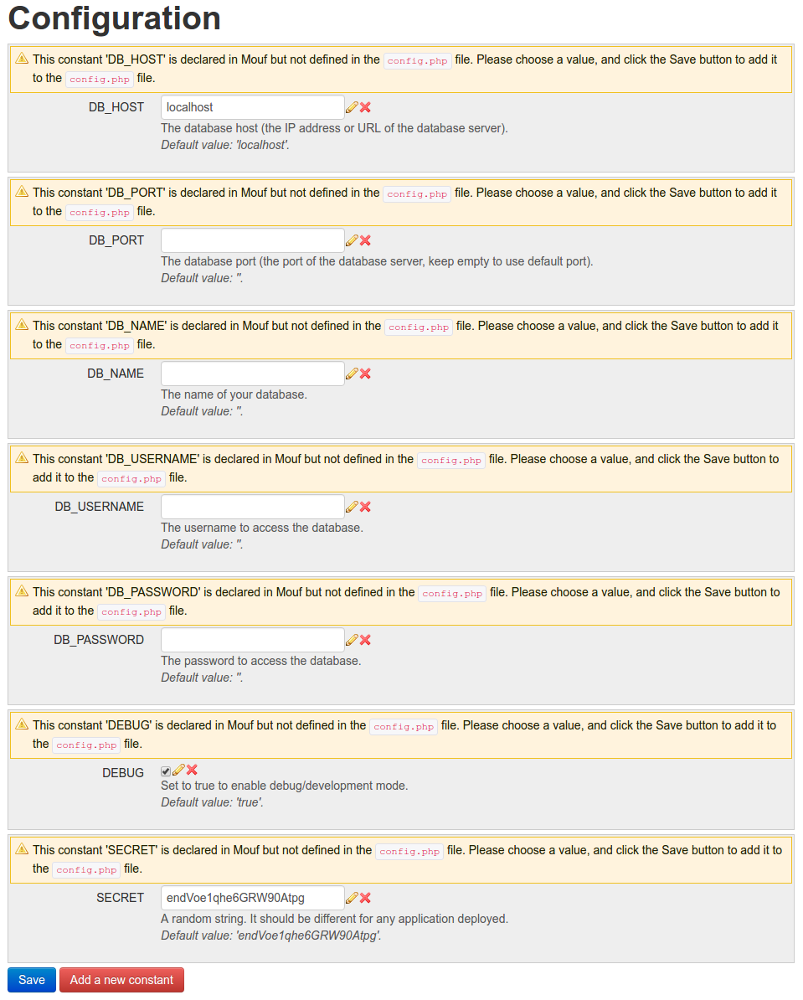
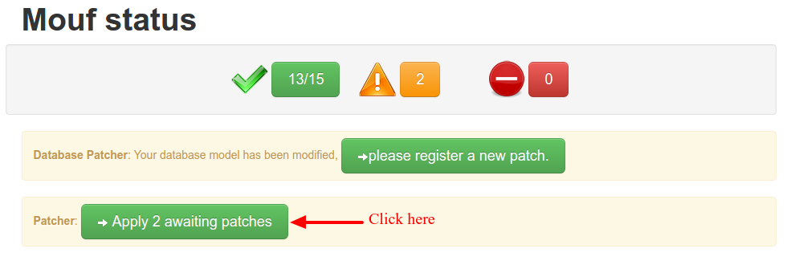

Mouf demo application
=====================

This is a very simple demo application showing a base Mouf project.

It uses:

- Splash 7 for the MVC part
- TDBM 4 for database access

The goal of this project is to help you get started with a classical Mouf application and to help you understand the look-and-feel of a Mouf app.

Prerequisites
-------------

To run this project you will need:

- A working PHP 7 installation with Apache
- Composer
- A MySQL database with an existing schema (you can call it "mouf_demo", or whatever you like)

Installing the application
--------------------------

Start by cloning this repository. Done? Let's run composer.

```php
composer install
```

Now, you should access the Mouf UI.

To do this, go to `http://localhost/[the_path_where_you_installed_the_demo]/vendor/mouf/mouf`.

- You will be asked to choose a user and a password to access Mouf. Pick one.
- Now log into Mouf
- On Mouf main page, you will see a number of errors. This is normal, you don't have configured your application yet.
- One of those errors is "Your config.php is empty. __Please configure your application.__". Click on the link.
  
- You will be redirected on a configuration page. Fill all the fields and click "Save".
  
- When you press the "Save" button, a `config.php` file will be created at the root of your project.
- You should be redirected to Mouf's main screen. Mouf will tell you it needs to apply 2 patches. Click the "Apply 2 awaiting patches button".
  
- This will actually create the needed tables in database.

You can now test your application.

Browse to `http://localhost/[the_path_where_you_installed_the_demo]/`.
 
The default login is 'admin@admin.com' and the password is 'admin'.


What you should see / pay attention to
--------------------------------------

This application is really very very simple. It is meant as a demo. You can see a main page, log in and then see a form to edit the user.

- You can see that a CSS stylesheet [has been added to make all titles appear red](public/moremouf.css).
- This CSS stylesheet is registered in the `webLibraryManager` instance in Mouf (you can search for this in the Mouf UI).
- You can also see how controllers are registered in Mouf, and how they use Twig to fill the template.
